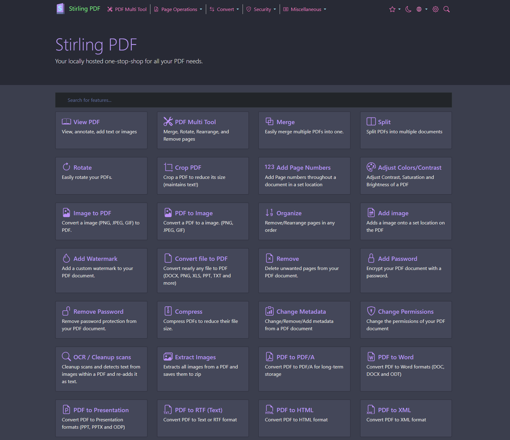

# Dracula for [Stirling-PDF](https://github.com/Frooodle/Stirling-PDF)
  > A dark theme for [Stirling-PDF](https://github.com/Frooodle/Stirling-PDF).



# Install

## Stirling-PDF (If not installed)
If you don't have Stirling-PDF installed, you can do so with the following `docker-compose.yaml`:
```yaml
version: '3.3'
services:
  stirling-pdf:
    image: frooodle/s-pdf:latest
    ports:
      - '8080:8080'
    volumes:
      - /path/to/data/directory:/usr/share/tesseract-ocr/5/tessdata #Required for extra OCR languages
      - /path/to/configs/directory:/configs
      - /path/to/customFiles/directory:/customFiles/
      - /path/to/logs/directory:/logs/
    environment:
      - DOCKER_ENABLE_SECURITY=false # Set to true to enable basic auth
      - SECURITY_ENABLE_LOGIN=false # If DOCKER_ENABLE_SECURITY is true, set this to true to enable login screen
```
## Instructions

1. First, create a `static` directory in your `/path/to/configs/directory`. Inside that `static` directory, create a directory called `css`.

2. Inside that `css` directory (ex: `/path/to/configs/directory/static/css`), create a `css` file called `dark-mode.css`.

3. Inside your  `dark-mode.css` file in your `/path/to/configs/directory/static/css`, paste the contents of [dark-mode](dark-mode.css) and save the file to apply the theme.

This is what you directory structure should look like if your `/path/to/configs/directory` is something like `/home/bob/MyContainers/StirlingPDF/custom_files`:

```
home
├── bob
|   ├── MyContainers
|   |   ├── StirlingPDF
|   |   |   ├── custom_files
|   |   |   |   ├── static
|   |   |   |   |   ├── css
|   |   |   |   |   |   ├── dark-mode.css
```

# Team

| [](https://github.com/Jas-SinghFSU) |
| ---------------------------------------------------------------------------------------- |
| [Jas Singh](https://github.com/Jas-SinghFSU)                                               |

## License

[MIT License](./LICENSE)
